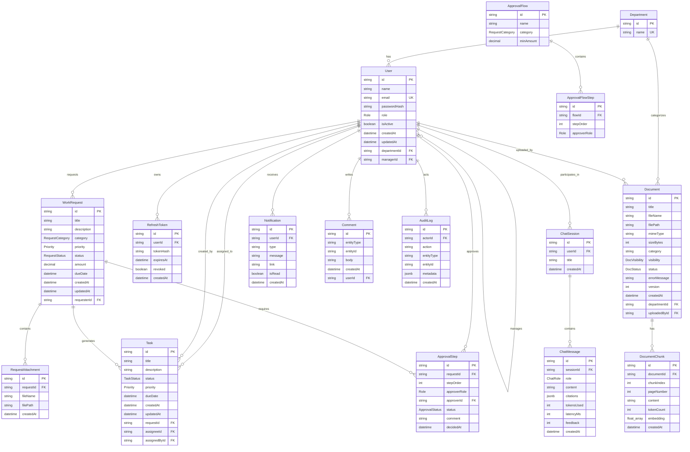

# NexusOps AI - Entity Relationship Diagram

```mermaid
erDiagram
    Department ||--o{ User : "has"
    Department ||--o{ Document : "categorizes"
    User ||--o{ User : "manages"
    User ||--o{ RefreshToken : "owns"
    User ||--o{ WorkRequest : "requests"
    User ||--o{ Task : "assigned_to"
    User ||--o{ Task : "created_by"
    User ||--o{ ApprovalStep : "approves"
    User ||--o{ Document : "uploaded_by"
    User ||--o{ ChatSession : "participates_in"
    User ||--o{ Notification : "receives"
    User ||--o{ Comment : "writes"
    User ||--o{ AuditLog : "acts"

    WorkRequest ||--o{ RequestAttachment : "contains"
    WorkRequest ||--o{ Task : "generates"
    WorkRequest ||--o{ ApprovalStep : "requires"

    ApprovalFlow ||--o{ ApprovalFlowStep : "contains"

    Document ||--o{ DocumentChunk : "has"

    ChatSession ||--o{ ChatMessage : "contains"

    Department {
        string id PK
        string name UK
    }

    User {
        string id PK
        string name
        string email UK
        string passwordHash
        Role role
        boolean isActive
        datetime createdAt
        datetime updatedAt
        string departmentId FK
        string managerId FK
    }

    RefreshToken {
        string id PK
        string userId FK
        string tokenHash
        datetime expiresAt
        boolean revoked
        datetime createdAt
    }

    WorkRequest {
        string id PK
        string title
        string description
        RequestCategory category
        Priority priority
        RequestStatus status
        decimal amount
        datetime dueDate
        datetime createdAt
        datetime updatedAt
        string requesterId FK
    }

    RequestAttachment {
        string id PK
        string requestId FK
        string fileName
        string filePath
        datetime createdAt
    }

    Task {
        string id PK
        string title
        string description
        TaskStatus status
        Priority priority
        datetime dueDate
        datetime createdAt
        datetime updatedAt
        string requestId FK
        string assigneeId FK
        string assignedById FK
    }

    Comment {
        string id PK
        string entityType
        string entityId
        string body
        datetime createdAt
        string userId FK
    }

    ApprovalFlow {
        string id PK
        string name
        RequestCategory category
        decimal minAmount
    }

    ApprovalFlowStep {
        string id PK
        string flowId FK
        int stepOrder
        Role approverRole
    }

    ApprovalStep {
        string id PK
        string requestId FK
        int stepOrder
        Role approverRole
        string approverId FK
        ApprovalStatus status
        string comment
        datetime decidedAt
    }

    Document {
        string id PK
        string title
        string fileName
        string filePath
        string mimeType
        int sizeBytes
        string category
        DocVisibility visibility
        DocStatus status
        string errorMessage
        int version
        datetime createdAt
        string departmentId FK
        string uploadedById FK
    }

    DocumentChunk {
        string id PK
        string documentId FK
        int chunkIndex
        int pageNumber
        string content
        int tokenCount
        float_array embedding
        datetime createdAt
    }

    ChatSession {
        string id PK
        string userId FK
        string title
        datetime createdAt
    }

    ChatMessage {
        string id PK
        string sessionId FK
        ChatRole role
        string content
        jsonb citations
        int tokensUsed
        int latencyMs
        int feedback
        datetime createdAt
    }

    Notification {
        string id PK
        string userId FK
        string type
        string message
        string link
        boolean isRead
        datetime createdAt
    }

    AuditLog {
        string id PK
        string actorId FK
        string action
        string entityType
        string entityId
        jsonb metadata
        datetime createdAt
    }
```
